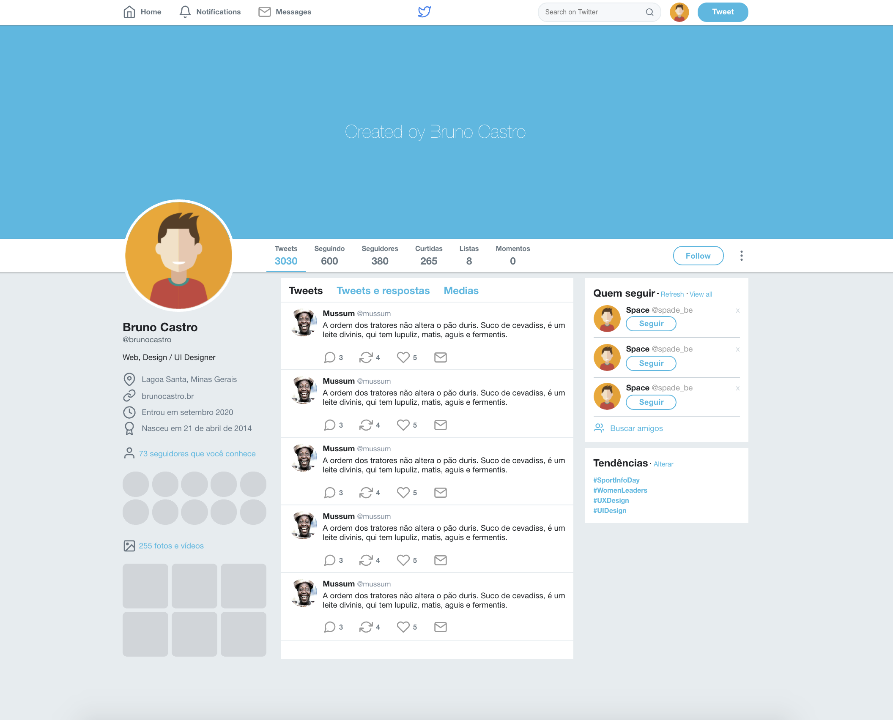

<h2 align="center">

  
Clonando a tela principal do Twitter
  

  <a href="#sobre">Projeto</a>&nbsp;&nbsp;&nbsp;|&nbsp;&nbsp;&nbsp;
  <a href="#tecnologias">Tecnologias</a>&nbsp;&nbsp;&nbsp;|&nbsp;&nbsp;&nbsp;
  <a href="#setup">Setup</a>&nbsp;&nbsp;&nbsp;|&nbsp;&nbsp;&nbsp;
  <a href="#layout">Layout</a>&nbsp;&nbsp;&nbsp;|&nbsp;&nbsp;&nbsp;
  <a href="#licença">Licença</a>

## Projeto

Clonando a tela principal do twitter com flex box.

## Tecnologias

Esse projeto foi desenvolvido com as seguintes tecnologias:

- [HTML](https://developer.mozilla.org/pt-BR/docs/Web/HTML)
- [CSS](https://developer.mozilla.org/pt-BR/docs/Web/CSS)
- [Flexbox](https://www.w3schools.com/css/css3_flexbox.asp)  

## Setup

Clone o repositório em sua maquina:

`git clone https://github.com/BrunoLagoa/twitter-clone`

## Layout

    

  

Você pode visualizar o layout do projeto através [desse link](https://www.figma.com/file/GHGS126t7WYjnPZdRKChJF/Proffy-Web). Lembrando que você precisa ter uma conta no [Figma](http://figma.com/) para acessá-lo.

 

---

## Licença

Esse projeto está sob a licença MIT. Veja o arquivo [LICENSE](LICENSE.md) para mais detalhes.

---

<h3 align="center">
Autor: <a alt="Bruno Castro" href="https://brunocastro.dev">Bruno Castro</a>
</h3>

  
  

